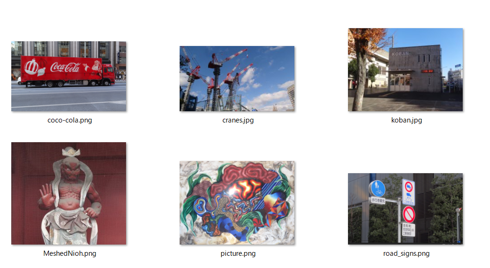
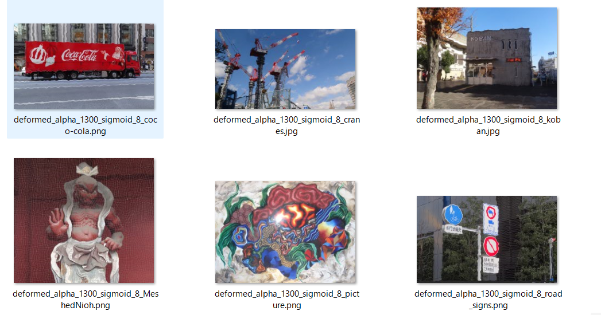
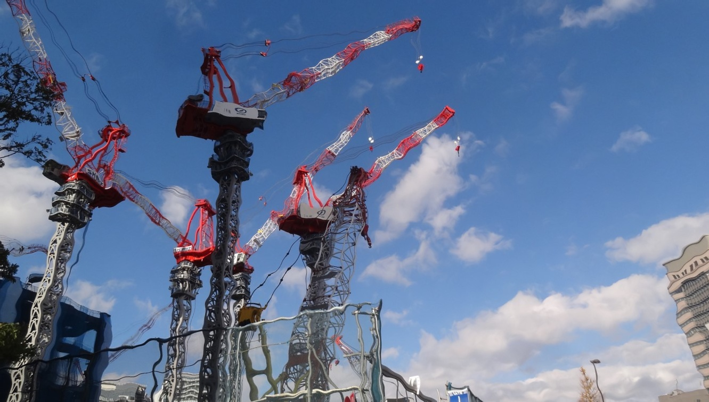
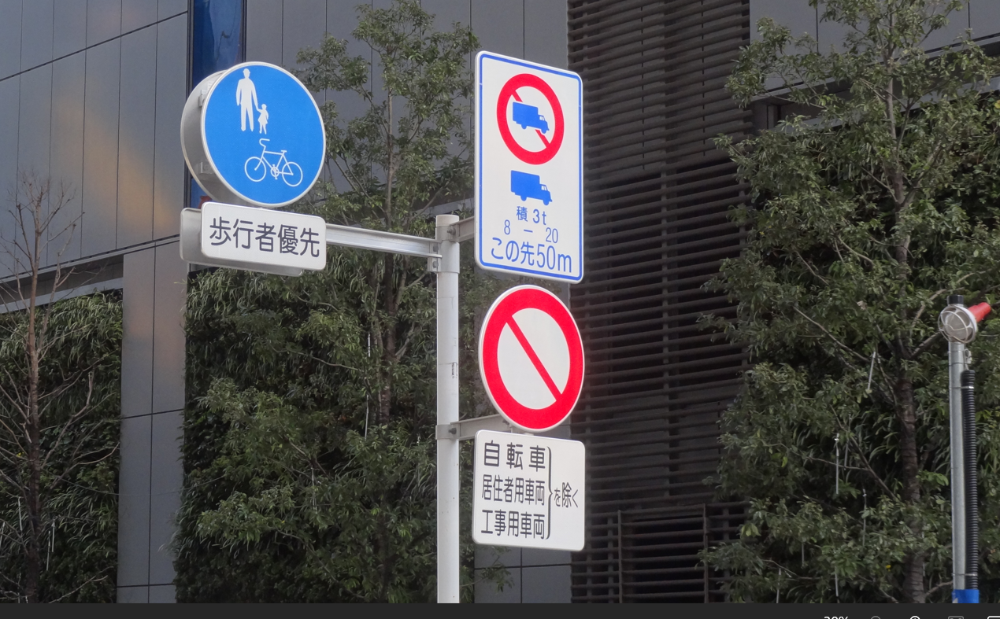
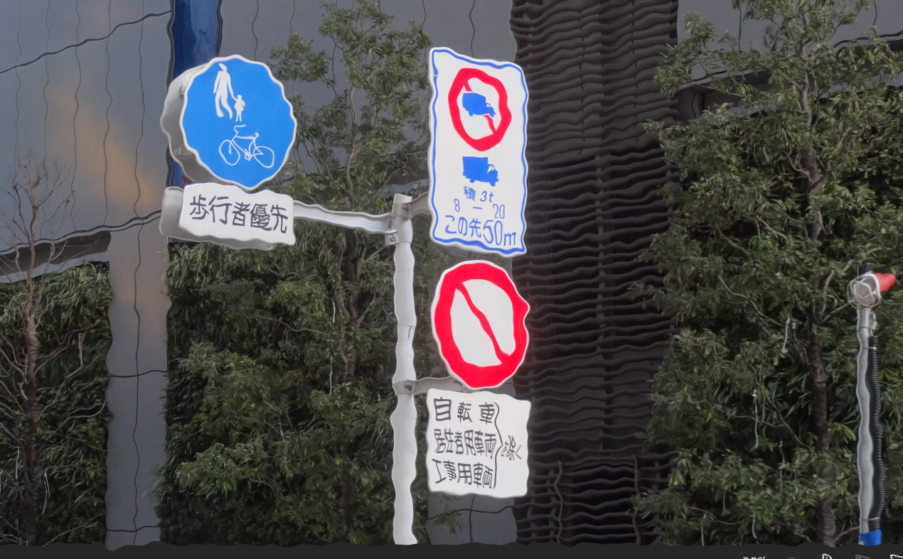
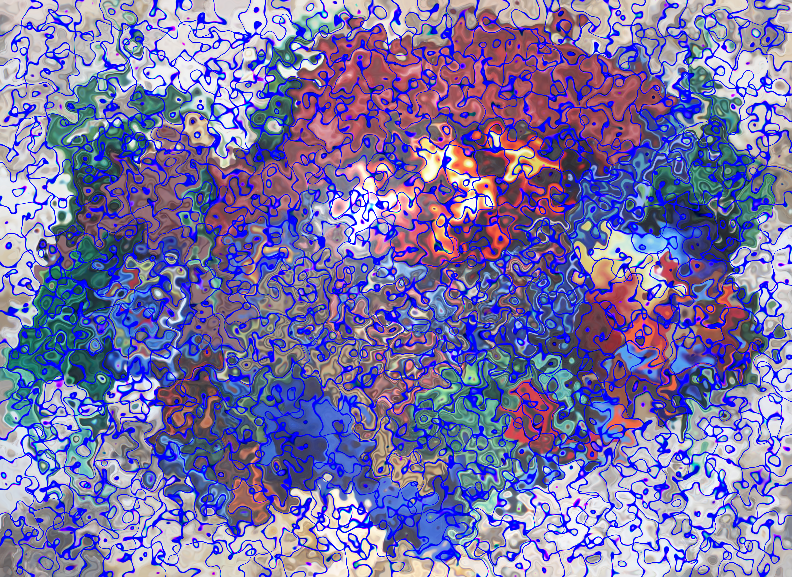
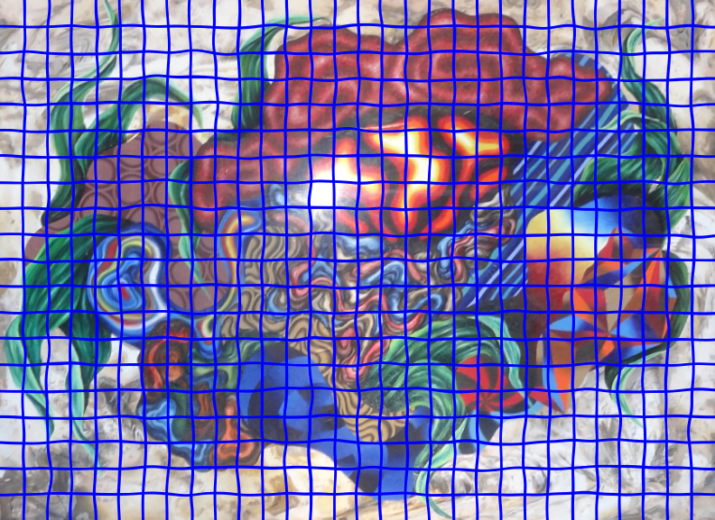

<h2> Image-Deformation-Tool (2024/04/04)</h2>

<a href="#1">1. ImageElasticDeformer</a> 
<a href="#2">2. Run ImageElasticDeformer</a> 
<a href="#3">3. Seeing Is Believing</a> 
 
<h3> 
<a id="1">1. ImageElasticDeformer</a>
</h3>

This is a simple python class <a href="./ImageElasticDeformer.py">ImageElasticDeformer</a> to deform an image 
by using scipy gaussian filter, map_coordinates, and numpy meshgrid functions. 
That class is based on the following code.  
https://github.com/MareArts/Elastic_Effect/blob/master/Elastic.py 
 
See also the following kaggle web-site. 
https://www.kaggle.com/code/jiqiujia/elastic-transform-for-data-augmentation/notebook
 
 
Deformation Example by ImageElasticDeformer 
  
As shown above, the deformed image generated by ImageElasticDeformer clearly indicates that it has been 
created using a grid-line-based deformation algorithm. 
Please see also our <a href="https://github.com/sarah-antillia/Image-Distortion-Tool">Image-Distortion-Tool</a>
 
 
In ImageElasticDeformer class, we use the following scipy and numpy functions. 
 
<a href="https://docs.scipy.org/doc/scipy/reference/generated/scipy.ndimage.gaussian_filter.html">scipy gaussian_filter</a>
<pre>
scipy.ndimage.gaussian_filter(input, sigma, order=0, output=None, mode='reflect', cval=0.0, 
   truncate=4.0, *, radius=None, axes=None)[source]
</pre>
, <a href="https://docs.scipy.org/doc/scipy/reference/generated/scipy.ndimage.map_coordinates.html">scipy map_coordinates</a>
<pre>
scipy.ndimage.map_coordinates(input, coordinates, output=None, order=3, 
   mode='constant', cval=0.0, prefilter=True)
</pre>
, and <a href="https://numpy.org/doc/stable/reference/generated/numpy.meshgrid.html">numpy meshgrid</a>.
<pre>
numpy.meshgrid(*xi, copy=True, sparse=False, indexing='xy')
</pre>

This ImageElasticDeformer runs on Python 3.8 or later version. Please install opencv-python and scipy to your Python development environment.   
This tool can be used to augment the image and mask files to train an image segmentation model.
You can use this class to train a segmentation model for your online dataset augmentation tool. 
Image deformation can be time-consuming when used for online dataset augmentation, which will slow down the training-speed.
 
For example, in the Python script <a href="https://github.com/sarah-antillia/Tensorflow-Image-Segmentation-API/blob/main/src/ImageMaskAugmentor.py">ImageMaskAugmentor.py</a>, we have implemented an elastic_transorm method similar to this Deformer class
to augment the images and masks in a training process for a segmentation model. 

 
<h3>
<a id="2">2. Run ImageElasticDeformer</a>
</h3> 
To run ImageElasticDeforer, please specify a <i>deformation.config</i> as a command-line parameter as shown below.
<pre>
>python ImageElasticDeforer deformation.config
</pre>
deformation.config file takes a typical ini file format. 
<pre>
;deformation.config
[deformation]
; Image input directory
images_dir  = "./images"
; Image output directory
output_dir  = "./deformed"
alpha       = 1300
;Specify a list of sigmoid
sigmoids    = [4,8,12]
</pre>

<h3>
2.1 Run ImageElasticDeforer with a deformation.config
</h3> 

Please run the following command.
<pre>
>python ImageElasticDeforer deformation.config
</pre>
, where deformation.config is the following. 
<pre>
;deformation.config
[deformation]
images_dir    = "./images"
output_dir    = "./deformed"
alpha         = 1300
sigmoids      = [10,]
</pre>
By running the command above, each image in images_dir will be read, deformed by the parameters in [deformation] section, and
saved to output_dir. 

Original images  
 

Deformed  
 

Enlarged sample images 
coca-cola  
 
deformed coco-cola 
 
 
 
cranes  
 
deformed cranes 
 
 
MeshedNioh  
 
deformed MeshedNioh 
 
 
road_signs  
 
deformed road_signs 
 

<h3>
<a id="3">3. Seeing Is Believing</a>
</h3> 
Please run the following command to visualize clearly the deformation effects of this tool,  
<pre>
>python ImageElasticDeforer deformation3.config
</pre>
, where deformation.config is the following. 
<pre>
;deformation3.config
[deformation]
images_dir  = "./meshed_images"
output_dir  = "./deformed3"
alpha       = 1300
sigmoids    = [4,8,12]
</pre>
Please note that there are three elements in sigmoids list as shown above. 
By this example, you can easily see the deformation effects by those parameters.

MeshedPicture  
 
 
Deformed sigmoid=4  
 
Deformed sigmoid=8  
 
Deformed sigmoid=12  
 

